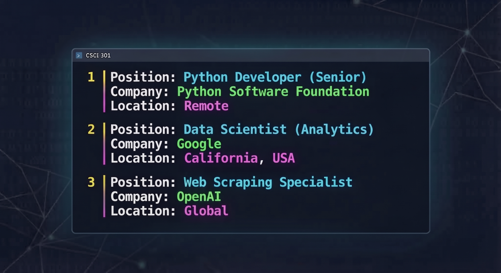
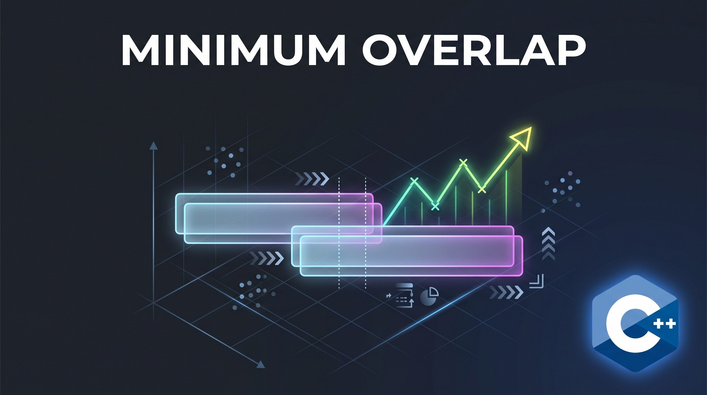
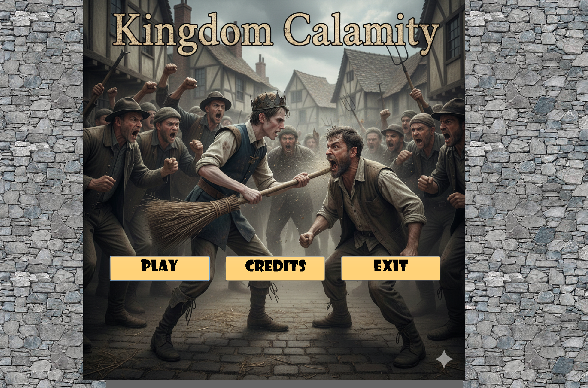
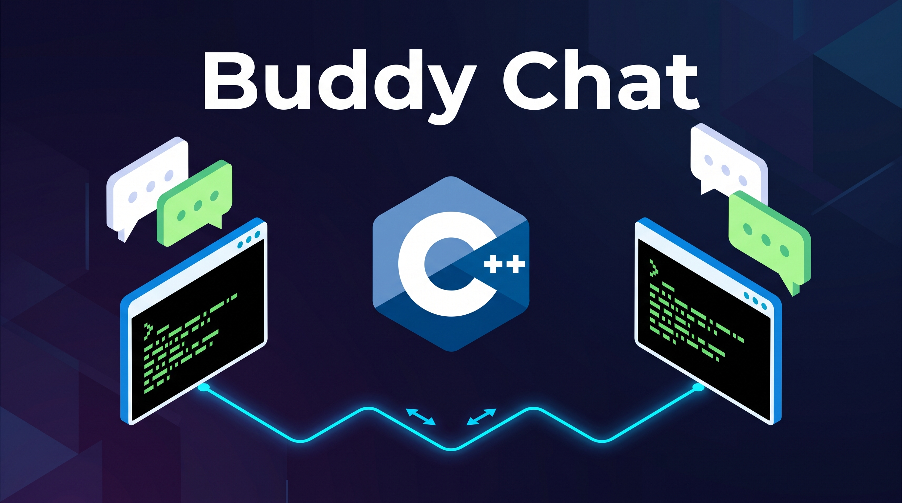

Portfolio
=========

Programming Projects
--------------------

*For access to my private project repositories, please [email me](mailto:kkchowcarlos@student.csuniv.edu) with the subject line, GitHub Access.

---
### [Python Job Board Web Scraper | CSCI 301](projects/project1.md)

---
### [Minimum Overlap | CSCI 315](projects/project2.md)

---
### [Kingdom Calamity | CSCI 325](projects/project3.md)

---
### [UDP Chat Application (Buddy Chat) | CSCI 332](projects/project4.md)

---

Ethics Papers
-------------

### [Ethical implications of AI](https://pdflink.to/kkccsci301/)

-   **Class:** CSCI 301 - Survey of Scripting Languages  
-   **Grade:** A

### [Responsibility in Automated Software Testing](https://pdflink.to/kkccsci315/)

-   **Class:** CSCI 315 - Data Structure Analysis
-   **Grade:** A

### [Ethical Dilemmas as a future Software Developer](https://pdflink.to/kkccsci325/)

-   **Class:** CSCI 325 - Object-Oriented Programming
-   **Grade:** A

---

Presentations
-------------

### [Classes & Inheritance](https://www.image2url.com/r2/default/presentations/1789666432111-c2d1c3c8-b1d4-4de2-8f26-310049f7db15.pptx)

- **Class:** CSCI 217 - Practical Programming and Problem Solving
- **Grade:** A

### [Kingdom Calamity](https://www.image2url.com/r2/default/presentations/1789666606952-393281f0-116d-45b0-b356-b247d8c99278.pptx)

- **Class:** CSCI 325 - Object-Oriented Programming
- **Grade:** A

---

Page template forked from <a href="https://github.com/csu-cs/csci-portfolio">CSU-CS</a>

<!-- Remove above link if you don't want to attributive -->
