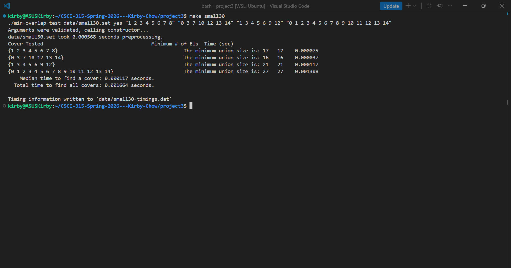
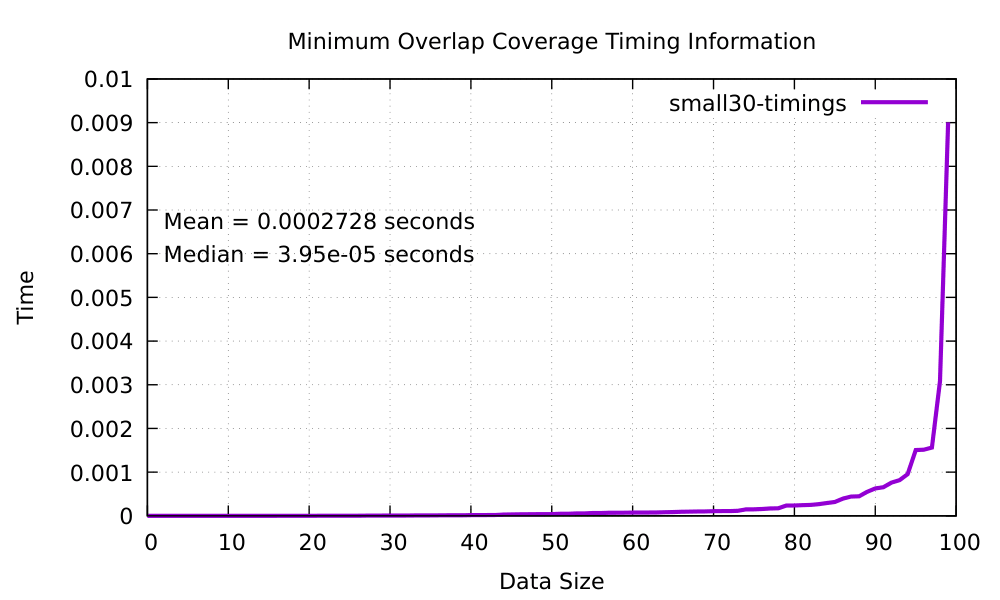

[Back to Portfolio](../index.md)

# Minimum Overlap

* **Class:** CSCI 315 - Data Structures Analysis
* **Grade:** A
* **Language(s):** C++
* **Source Code Repository:** [Minimum Overlap](https://github.com/Halowac/Minimum_Overlap) *(Please email me to request access.)*

---

## Project Description

This project is a C++ application focused on solving the Minimum Overlap with repetition problem. The program is designed to process multiple test data sets of varying sizes to find the smallest set union that contains all the data. Additionally, the system includes tools to record the execution times of the operations and export the results for graphical visualization using `Gnuplot`.

---

## How to Run the Program

To facilitate the compilation and linking of the C++ code, the project includes an automated `Makefile`. You can run the program from the terminal by following these steps:

1. Ensure you have `make`, `Gnuplot` and a C++ compiler (such as `g++`) installed on your system.
2. Navigate to the root directory of the project and execute the following command to compile the source code:

   ```bash
   make

3. Once the executable file is generated, you can run the program by passing one of the data sets included in the `data/` folder as an argument. For example:

   ```bash
   ./minimum_overlap data/small30.set

4. To view the performance analysis based on the generated timing files (`-timings.dat`), execute the visualization script with Gnuplot:

   ```bash
   gnuplot data/data.gnuplot

## UI Design

This program utilizes a Command-Line Interface. User interaction is handled entirely through terminal commands and file arguments.
However, the project features a data visualization component. By processing the generated execution logs through the included `data.gnuplot` script, the system outputs performance graphs that visually represent the algorithm's time complexity.


* **Fig 1.** Terminal execution displaying the calculated minimum overlap for a given dataset.


* **Fig 2.** Gnuplot visualization of the algorithm's runtime performance using one dataset.

## Additional Considerations

* **Scalability Testing:** The algorithm was specifically designed and tested to handle increasing computational loads and evaluate asymptotic behavior.

[Back to Portfolio](../index.md)
