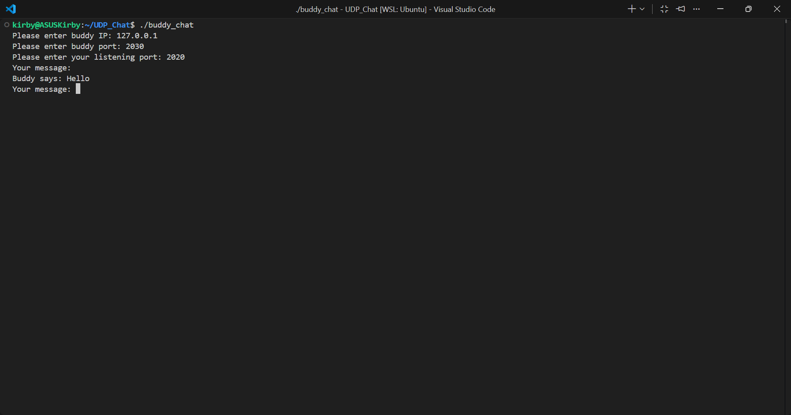

[Back to Portfolio](../index.md)

# UDP Chat Application (Buddy Chat)

* **Class:** CSCI 332 - Applied Networking
* **Grade:** A
* **Language(s):** C++
* **Source Code Repository:** [UDP Chat](https://github.com/Halowac/UDP_Chat/tree/main) *(Please email me to request access.)*

---

## Project Description

This project is a peer-to-peer chat application developed in C++ that enables bidirectional communication between two users over the same network. The system uses UDP sockets to establish the connection and transmit messages. To allow the user to send and receive messages simultaneously, the program implements multithreading using `POSIX` threads. A dedicated server thread continuously listens on the local port, while a client thread processes and sends the user's input to the recipient.

---

## How to Run the Program

Since this project is developed in C++, it requires compilation before it can be executed. It is also exclusive to Linux or macOS environments. For Windows execution, using WSL is required. You can compile and run the program from the terminal by following these steps:

1. Ensure you have a C++ compiler (such as `g++`) and the standard `POSIX` libraries installed on your system.
2. Navigate to the directory where the source files are located and compile the program using the `buddy.cpp` file, making sure to link the thread library:

   ```bash
   g++ buddy.cpp -o buddy_chat -pthread
   
4. Execute the generated binary:

   ```bash
   ./buddy_chat

4. Follow the on-screen instructions to enter your buddy's IP address, their network port, and your own local listening port.

---

## UI Design

Since this is a command-line interface application, all user interaction takes place directly within the terminal. The program first prompts for network configuration parameters before entering the main messaging loop.


* **Fig. 1** The program maintains a constant on-screen prompt displaying `Your message:` to indicate that it is ready to send the next string.


* **Fig. 2** Incoming messages received over the network are printed to the console with the prefix `Buddy says:`

---

## Additional Considerations

* **Thread Synchronization (Mutex):** Because both the main thread and the server thread access the same message storage vector (`vector<string> incoming`), the program utilizes mutual exclusion locks (`pthread_mutex_t`). This ensures that memory is read and written safely, preventing race conditions.

[Back to Portfolio](../index.md)
